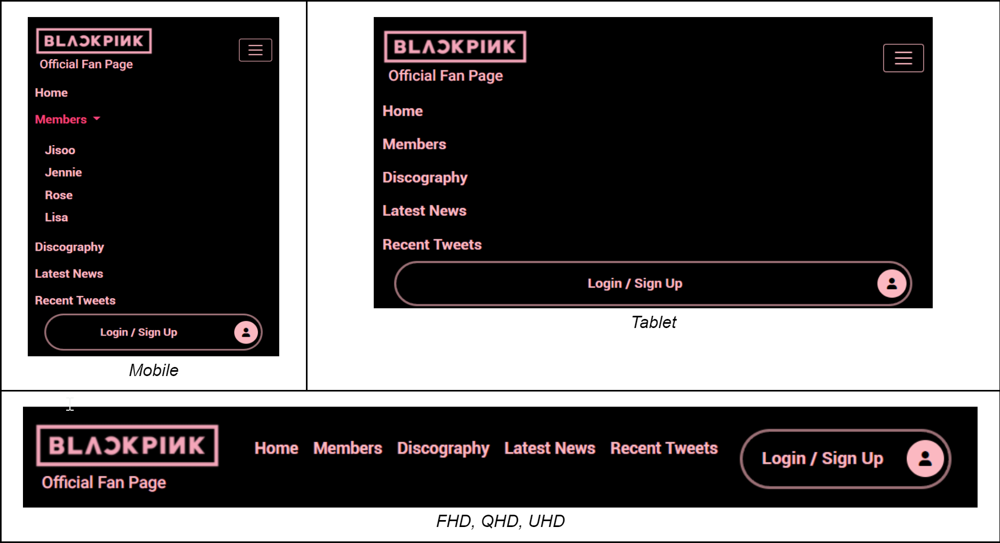
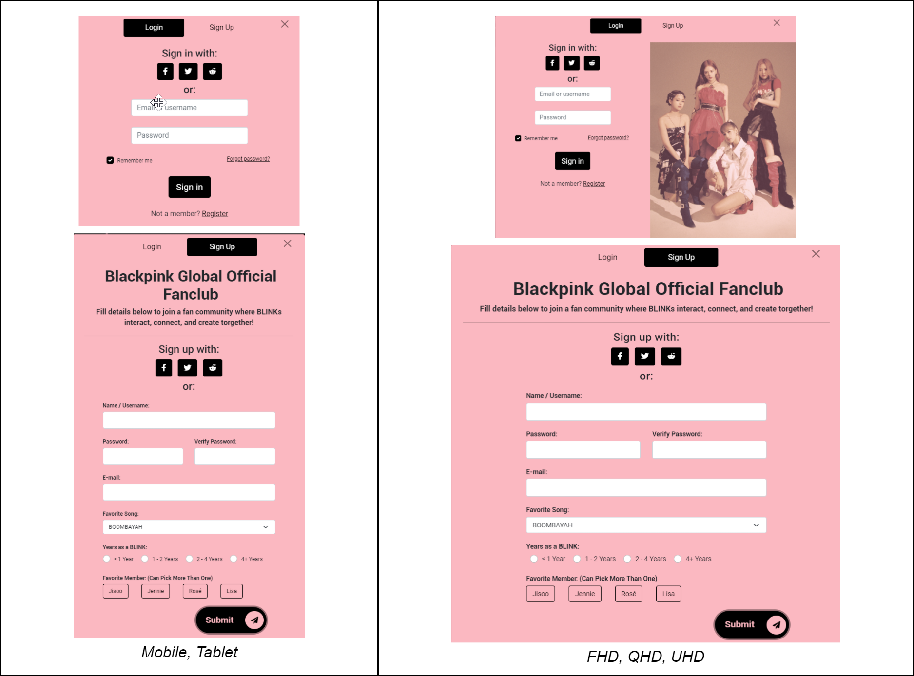
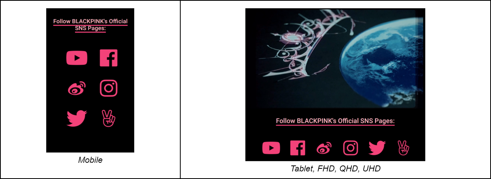
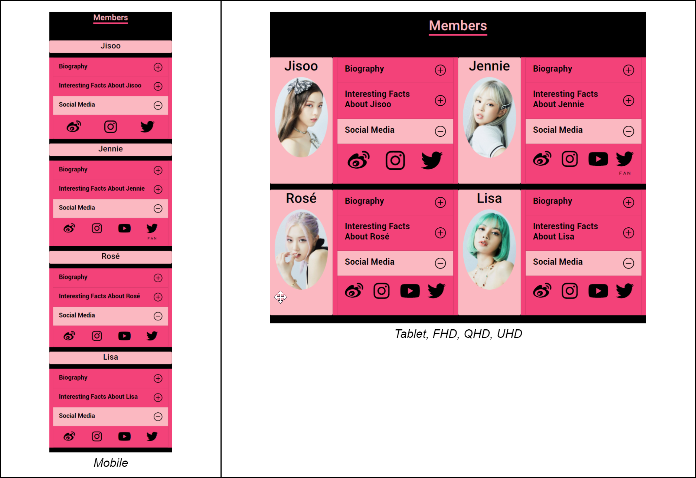
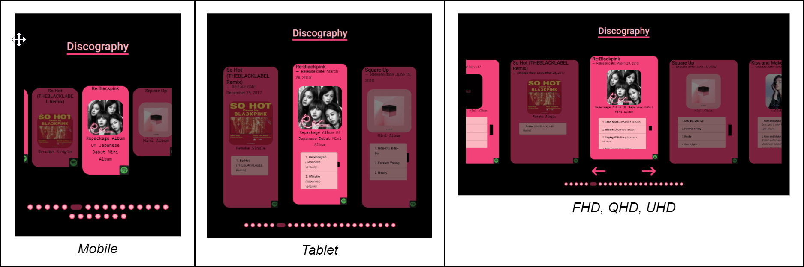
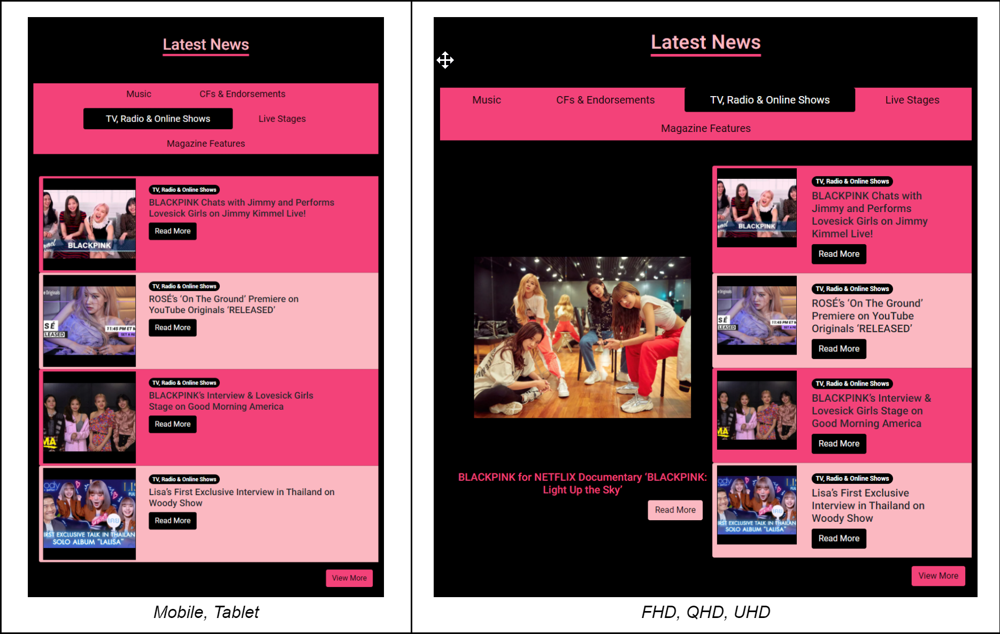
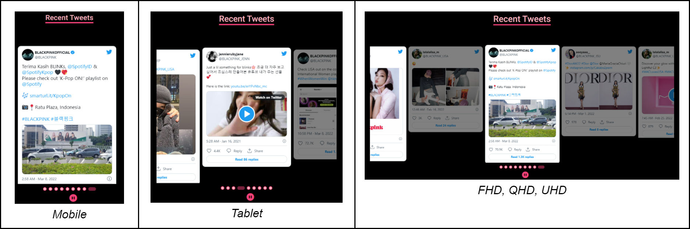
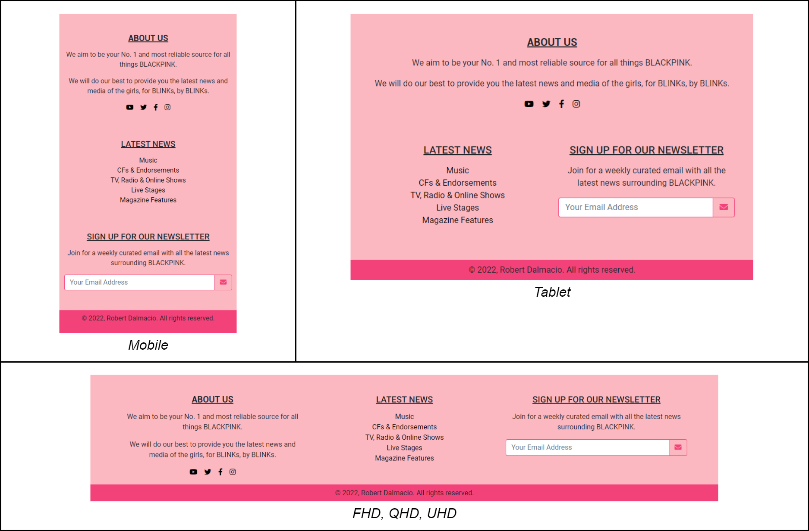

#  Blackpink Fan Page

## Introduction 
I will be creating a fan page for the Kpop group Blackpink. __The goal of this website is to act as a central information hub for the all latest news, social posts, and updates pertaining to the members of Blackpink.__ It will also offer users that choose to register an account, access to a social news platform to discuss and vote on content that other users have submitted, similar to the massively popular discussion website, Reddit.

The key features of my static bootstrap website are:
* Fully responsive design and layout for mobile, tablet, FHD, QHD and UHD displays.
* Login and Signup pop-up modal to allowed registered users to login, and new users to signup for an account using bootstrap styled forms.
* Biography, interesting facts and social media links of each group member displayed using bootstrap accordions.
* Discography carousel using Owl-Carousel a jQuery plugin, displaying the group’s albums in a bootstrap card element with links to Spotify playlists.
* Latest news section showcasing categorized news posts and displayed using bootstrap tabs.
* Recent tweets section carousel also using Owl-Carousel, displaying recent tweets from the group and each member’s twitter accounts.

## Design and Implementation

> __Navbar:__ Sticky-top navbar menu with brand logo and button to activate “Login/Sign Up pop-up modal”. Fully responsive with toggler button on mobile and tablet devices. Dropdown list for “Members” section on mobile devices.

>__Login/SignUp Modal:__ Pop-up modal with two different tabs, “Login” and “Sign Up”. Uses bootstrap input groups, select, floating labels components, and styled using form control. On FHD screens and larger, an image is also shown on the Login tab.

>__Home/Intro Section:__ Displays various social media links using clickable icons. On mobile screens, icons are displayed in 2 columns and 3 rows. On tablets and larger screens, icons are displayed on one row. Also shown on tablets and larger screens is an mp4 intro video.

>__Members Section:__ Uses bootstrap’s vertically collapsing accordions to display member’s biography, interesting facts, and clickable icons linking to members’ social media accounts. Bootstrap accordion customization was achieved by changing default variables in Sass. On mobile screens, member images are not displayed and each member is shown in one row. On tablets and larger screens, member images are displayed and two members are shown in one row.

>__Discography Section__: The bootstrap carousel didn’t allow the use of cards instead of slides so I had to use a responsive touch-enabled carousel slider jQuery plugin, “Owl Carousel 2”. Each album card displays the album name, release date, album cover and on tablets and larger screens, the list of songs in the album. There is also a clickable Spotify icon that links the user to the album playlist on Spotify. On FHD and larger screens, navigation arrows are shown for easier scrolling.

>__Latest News Section__: This section uses tabs to display different news categories. Bootstrap horizontal cards are used for each post. A featured post is shown on FHD and larger screens.

>__Recent Tweets Section__: Similar to the discography section this section also uses the Owl Carousel jQuery plugin to display each tweet as a separate card. Recent tweets are embedded manually from each of the members' Twitter accounts. The carousel is configured to cycle every 5 seconds, a play/pause button is included to stop and resume the carousel.

>__Footer__: Fully responsive footer with an “About Us” section with clickable social media links, links to each news category, and a newsletter sign-up form.

## Market Survey
1. [YG Dreamers](https://ygdreamers.com) - WordPress fansite page with blog posts for recent news about Blackpink, separated by topics such as music, news, event, … etc.
2. [r/BlackPink](https://www.reddit.com/r/BlackPink) - Subreddit forum for Blackpink fans, subscribed users can contribute to the page with content such as images, text, videos, and links. All content on the site can be voted up or down by other members.
3. [BLACKPINK Members Profile](https://kprofiles.com/black-pink-members-profile) - Simple website acting as a Kpop database with Kpop and K celebrity profiles, similar to IMDb, for movies and actors.
4. [YG Entertainment Artist: Blackpink](https://www.ygfamily.com/artist/Main.asp?LANGDIV=E&ARTIDX=70) - Simple page on the YG entertainment company website about their artist Blackpink, has information about albums, and upcoming content from the group.
5. [Blackpink Music Shop](https://shop.blackpinkmusic.com/) - Official Blackpink merchandise site, showcases Blackpink theme colors, designs, and logos.
